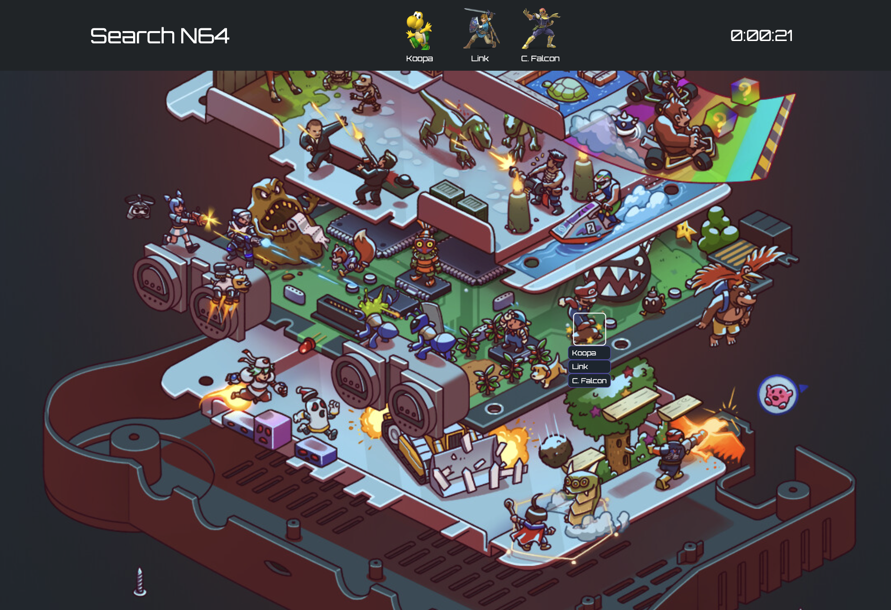
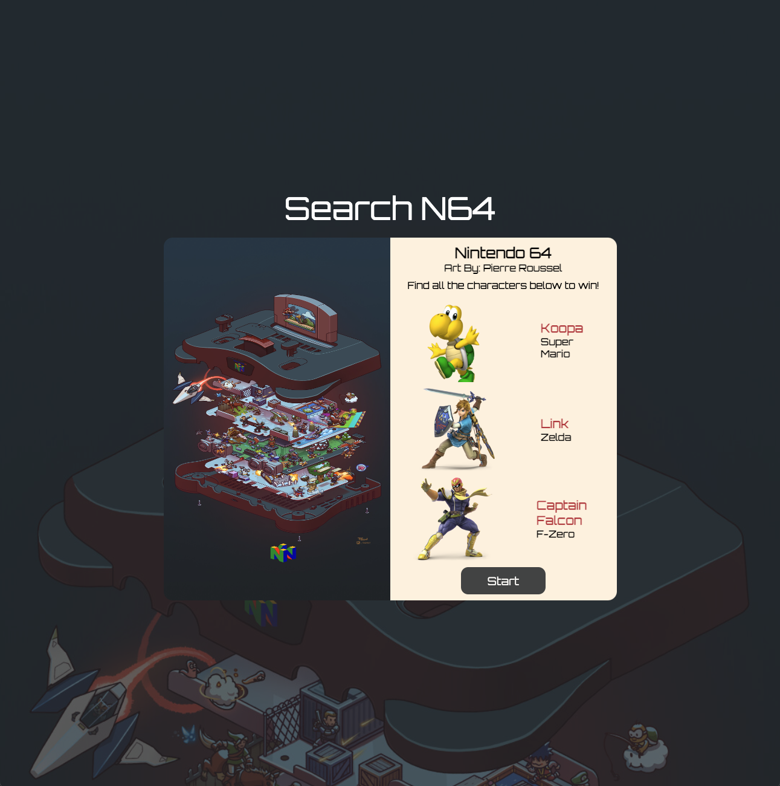
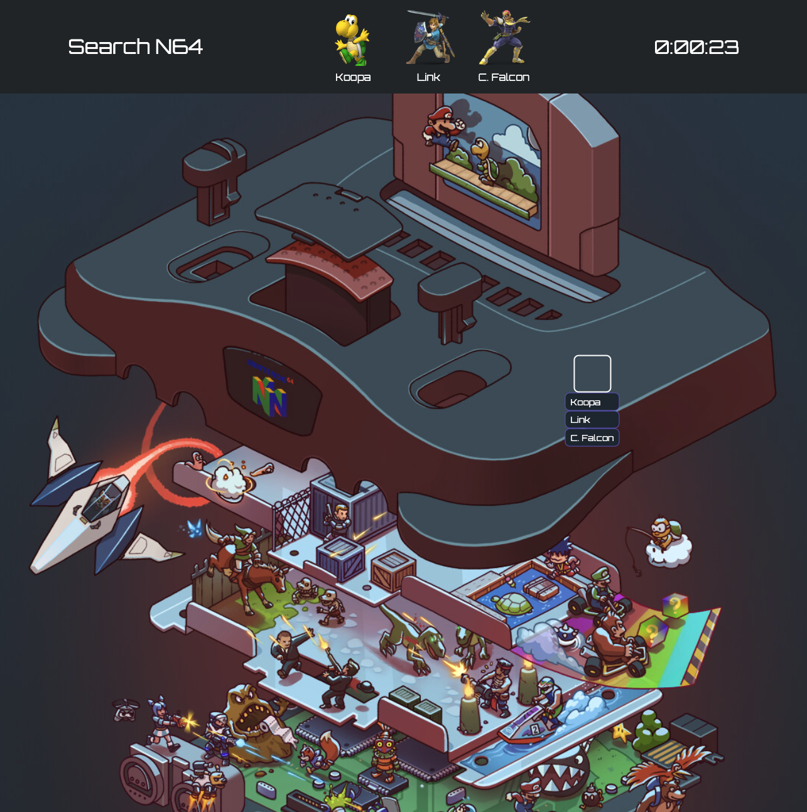
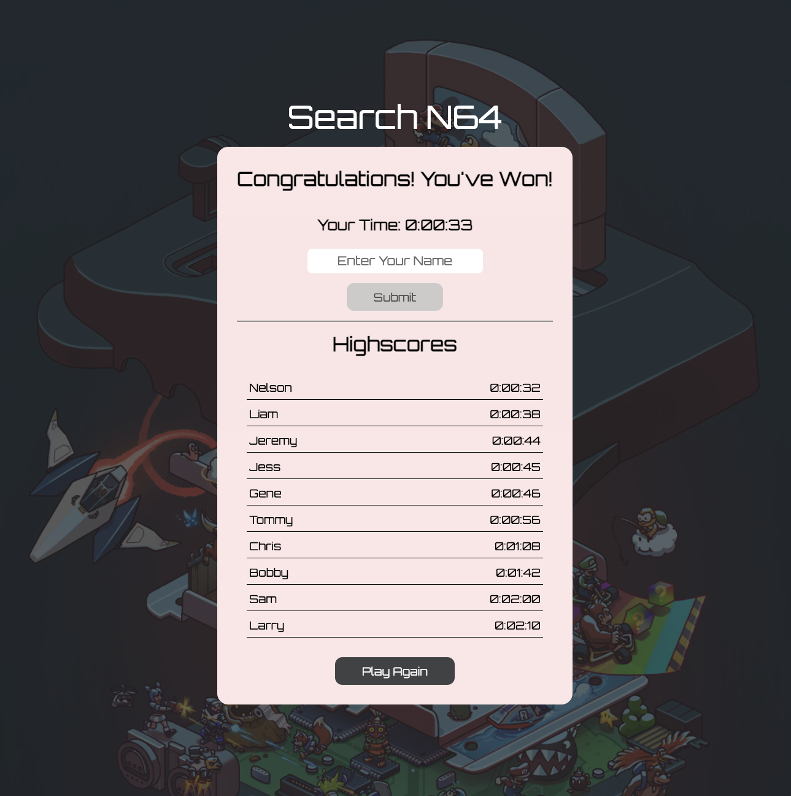
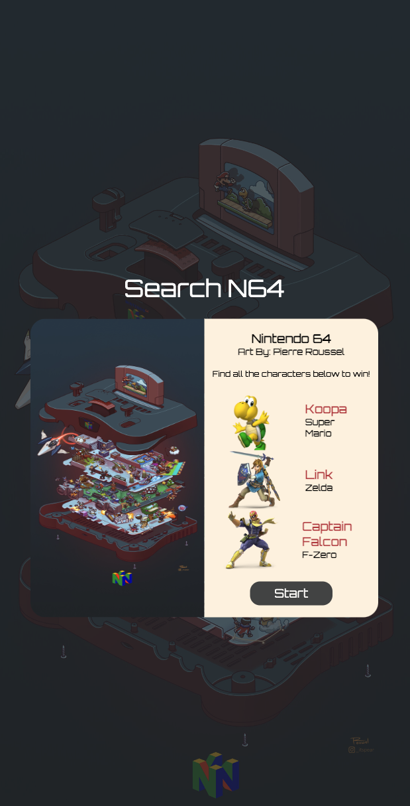
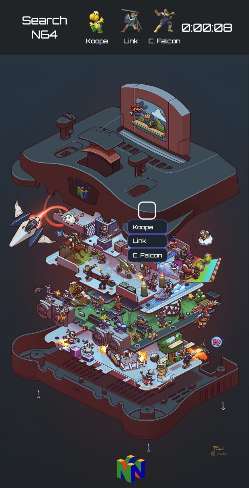
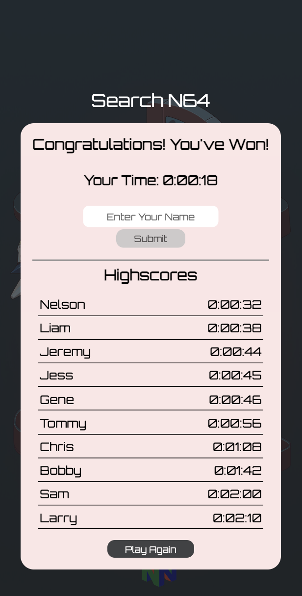

<h1 align="center">Search N64</h1>
<p align="center">A photo tagging game.</p>

<div align="center"> 
  
</div>

<br />

This is a full-stack photo-tagging game reminiscent of "Where's Waldo" built with React!

## Getting started

```
git clone git@github.com:NelsonMN/photo-tagging-app.git
cd photo-tagging-app
npm install
npm start
```

## Preview

### Desktop

<div align="center">
  





</div>

### Mobile

<div float=left align="center">
  
    
  

</div>

### Built With

- [React.js](https://reactjs.org/)
- [React Hooks](https://reactjs.org/docs/hooks-intro.html)
- [Create React App](https://create-react-app.dev/)
- [JavaScript](https://www.javascript.com/)
- [Google Firebase](https://firebase.google.com/?gclid=CjwKCAjw6fyXBhBgEiwAhhiZsiQrom0ybCJ0qw_ECKj80EoxJR_eaVd7HiT6b0B2bT1UDgwt_46AlRoCqS4QAvD_BwE&gclsrc=aw.ds)

## Contact

Nelson M - https://www.linkedin.com/in/nelsonmieszkalski/

Project Link: [https://nelsonmn.github.io/photo-tagging-app/] (https://nelsonmn.github.io/photo-tagging-app/)
